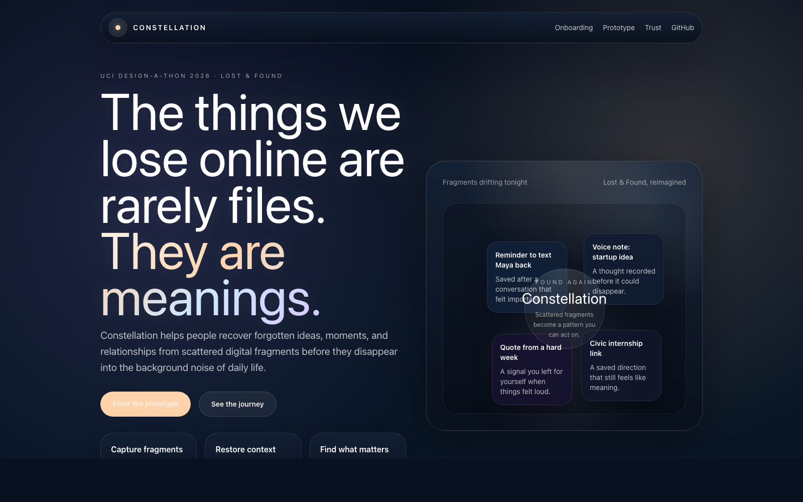
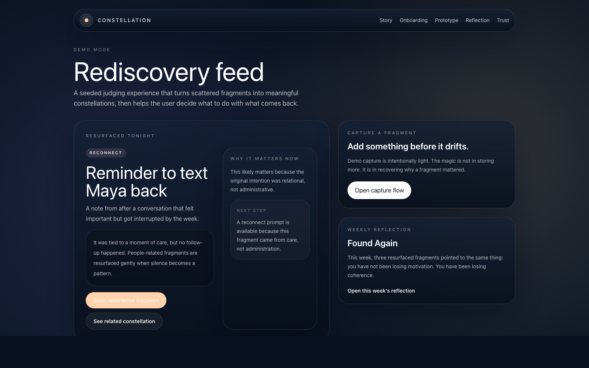
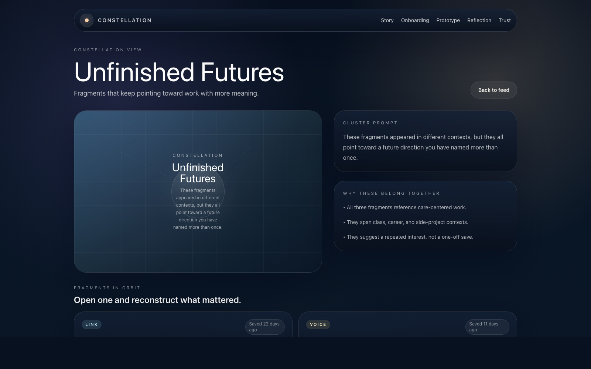
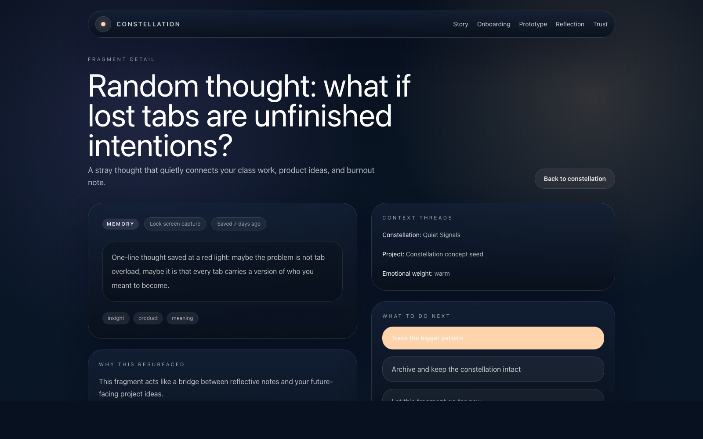
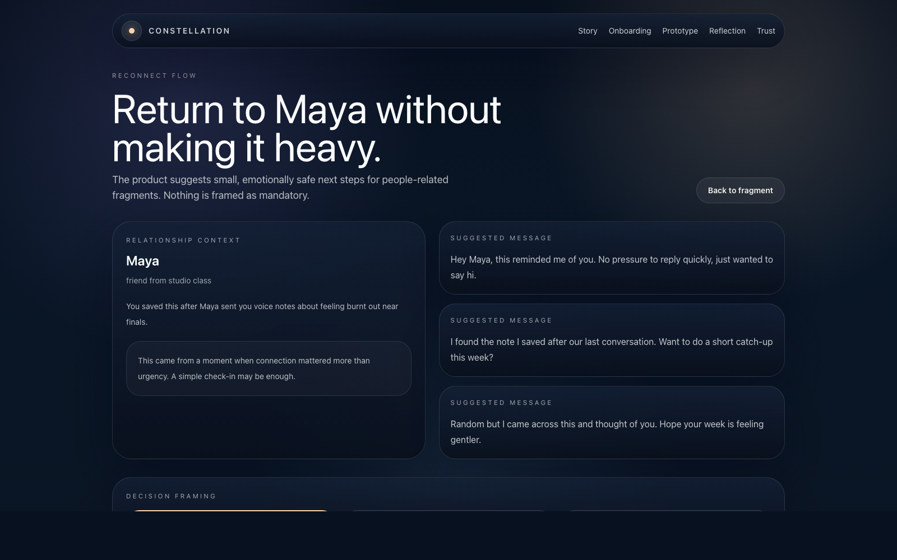
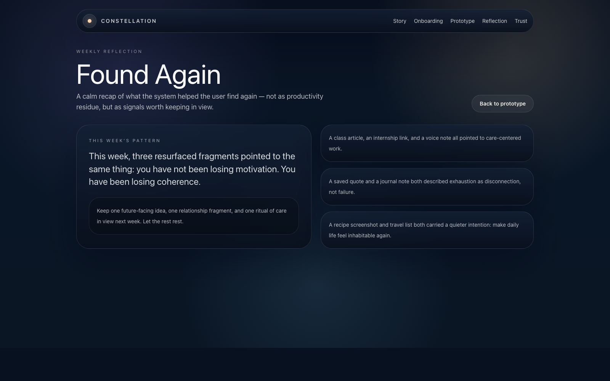

# Constellation

**One-line pitch**  
An AI-assisted space for recovering forgotten ideas, moments, and connections from scattered digital fragments before they disappear.

**Prototype**  
Web prototype link: [https://constellation-bice.vercel.app](https://constellation-bice.vercel.app)  
Figma working file: currently team-only; update Figma share settings before external judging.

## Theme Fit

Constellation interprets **Lost & Found** as the recovery of fragments that were never deleted, only dispersed. Screenshots, half-written notes, voice thoughts, saved links, names, and unfinished intentions drift across a user's digital life until the product helps them find what still matters.

The first screen makes that premise legible immediately: forgotten fragments are visualized as stars in a calm night field, then gathered into constellations that restore meaning.

## Feature Overview

- **Story-led landing page** that frames the emotional cost of fragmented memory.
- **Lightweight onboarding** that explains how fragments become constellations.
- **Fragment capture flow** for notes, screenshots, links, voice thoughts, memory prompts, and people-based reminders.
- **Rediscovery feed** that surfaces items based on unfinished intent, emotional weight, repetition, and timing.
- **Constellation map** that groups scattered fragments into meaningful themes.
- **Fragment detail view** that reconstructs context and explains why an item resurfaced.
- **Reconnect flow** for people-related fragments with low-pressure next-step prompts.
- **Weekly reflection** that turns saved clutter into a gentle personal narrative.
- **Privacy and trust page** that explains boundaries for AI assistance.
- **Live NVIDIA NIM integration** for capture clustering and weekly reflection prompts, with safe demo fallbacks if the provider is unavailable.

## Why This Stands Out

- It addresses a widely felt but under-designed problem: **context loss**, not just storage.
- It feels emotionally resonant without becoming sentimental or intrusive.
- It uses AI with restraint, clarity, and transparent uncertainty.
- It is memorable in seconds because the product metaphor is immediate and cohesive.
- It gives judges a visible design process, not just a polished UI.

## Repository Structure

```text
/
├── README.md
├── SUBMISSION_SUMMARY.md
├── PROBLEM_STATEMENT.md
├── SOLUTION_OVERVIEW.md
├── DESIGN_PROCESS.md
├── RESEARCH_PLAN.md
├── USER_PERSONAS.md
├── JTBD.md
├── COMPETITIVE_ANALYSIS.md
├── HOW_MIGHT_WE.md
├── USER_FLOW.md
├── WIREFRAME_NOTES.md
├── USABILITY_TEST_PLAN.md
├── USABILITY_SYNTHESIS_TEMPLATE.md
├── PITCH_SCRIPT.md
├── JUDGING_TALK_TRACK.md
├── TEAM_ROLES_TEMPLATE.md
├── app/
├── components/
├── lib/
├── public/
└── .github/workflows/
```

## Prototype Setup

```bash
npm install
npm run dev
```

Open `http://localhost:3000`.

## Deployment Instructions

### Current GitHub to Vercel Path

This repository is configured to deploy from **GitHub Actions to Vercel**.

1. Push to `main`.
2. GitHub Actions runs `.github/workflows/verify.yml` to type-check and build.
3. GitHub Actions runs `.github/workflows/deploy.yml` to publish production on Vercel.
4. Public prototype: [https://constellation-bice.vercel.app](https://constellation-bice.vercel.app)
5. Figma working file is still team-only; update its share permissions before using it as a judge-facing artifact.

### Why This Path Was Chosen

The repository does not depend on local linking or manual Vercel dashboard import. It stays GitHub-first and can later be switched to native Vercel Git integration if the Vercel GitHub App is installed on the account.

## NVIDIA NIM Setup

NVIDIA NIM is used only where AI materially improves rediscovery.

**Suggested environment variables**

```bash
NVIDIA_NIM_API_KEY=
NVIDIA_NIM_BASE_URL=
NVIDIA_NIM_MODEL=
```

**Current integration points**

- Live today: the capture flow sends a clustering prompt to `/api/nim`.
- Live today: the weekly reflection card can generate a gentle resurfacing prompt from `/api/nim`.
- Available route modes in `app/api/nim/route.ts`: clustering, context recovery, reflection, and reconnect.
- If the provider is unavailable, the app returns a safe fallback response instead of hallucinating certainty.

## Architecture Overview

- **Frontend:** Next.js App Router + TypeScript
- **Styling:** Tailwind CSS with custom celestial tokens in `app/globals.css`
- **Motion:** Framer Motion for subtle reveal, clustering, and feedback moments
- **Data layer:** seeded in-memory demo data from `lib/demo-data.ts`
- **AI integration:** optional `app/api/nim/route.ts` with safe, explicit fallbacks
- **Deployment:** GitHub Actions + Vercel production deploys
- **Design strategy:** landing + guided onboarding + route-based demo narrative

## Screenshots

### Landing page


### Rediscovery feed


### Constellation view


### Fragment detail


### Reconnect flow


### Weekly reflection


## Research Integrity

This repository intentionally **does not fake user research**.

The following files are structured so the team can add real evidence fast:

- `RESEARCH_PLAN.md`
- `USER_PERSONAS.md` (provisional; validate with interviews)
- `JTBD.md` (provisional; validate with interviews)
- `USABILITY_TEST_PLAN.md`
- `USABILITY_SYNTHESIS_TEMPLATE.md`

## What Must Be Replaced With Real User Research Before Judging

- Actual participant quotes
- Actual interview notes and synthesis
- Real usability test findings and iteration decisions
- Any claims about preference, pain intensity, or behavior frequency that currently rely on design hypotheses

## Credits

Created for **UCI Design-a-thon 2026** as a General Track + Most Novel submission concept centered on rediscovering what still matters.
